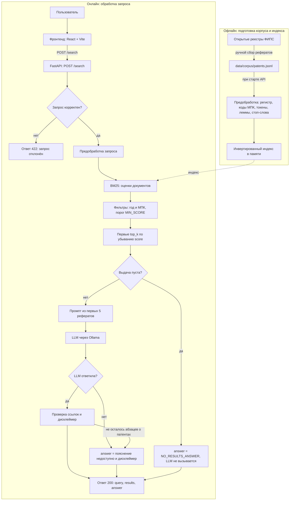
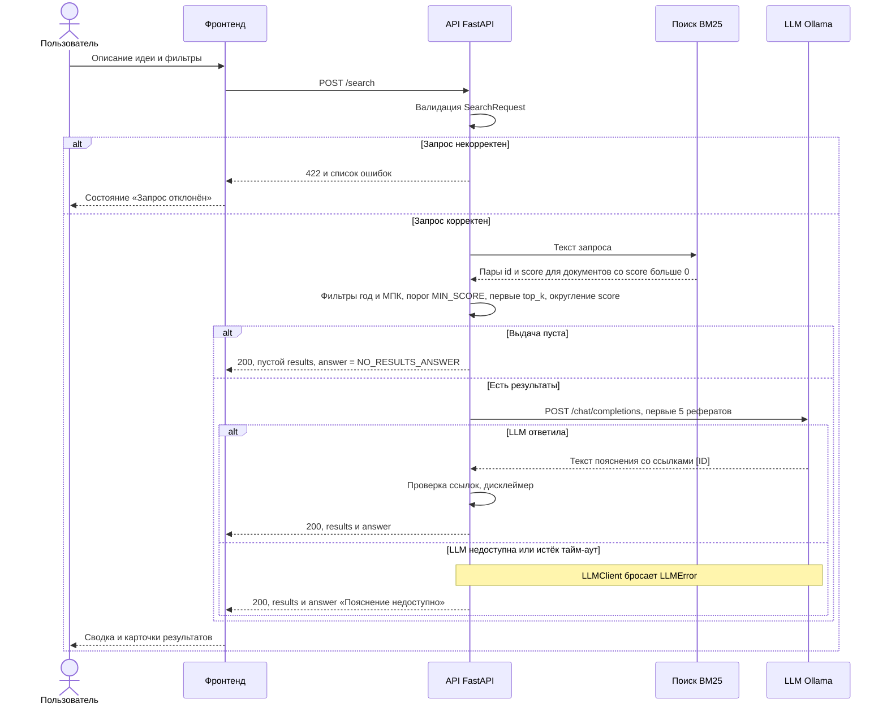

# Архитектура «Патентного радара»

Документ описывает устройство системы, контракт HTTP API между фронтендом и бэкендом и выбор языковой модели. Ответственный — Коля (интеграция). Состояние — контрольная точка 1 (КТ1): спецификации и прототип на заглушках, работающего поиска пока нет.

Связанные документы: [product.md](../product/product.md) и [scenarios.md](../product/scenarios.md) — продукт и пользовательские сценарии (Ника), [rag.md](rag.md) — поиск BM25 и RAG (Бобур).

## 1. Назначение и границы

«Патентный радар» — инструмент первичного поиска аналогов. Пользователь описывает идею изобретения обычными словами, система находит похожие патенты РФ в корпусе рефератов с помощью собственной реализации BM25, а локальная языковая модель (LLM) кратко объясняет сходства и отличия со ссылками на номера патентов.

Границы:

- **Корпус** — рефераты (INID 57) и названия (INID 54) патентов РФ, вручную собранные из открытых реестров ФИПС. Коды МПК (INID 51) и год публикации (INID 45) — метаданные для фильтров и показа. Полные описания и формулы в корпус не входят; обоснование — в [rag.md](rag.md).
- **Не юридическое заключение.** Ответ помогает найти аналоги, но не оценивает новизну и патентоспособность; каждый ответ с результатами заканчивается дисклеймером.
- **Данные не уходят в облако.** Поиск выполняется в процессе API, LLM работает на том же компьютере через Ollama.
- **Локальное приложение для одного пользователя:** без авторизации и без базы данных. API не сохраняет запросы; в журнал uvicorn попадают адрес клиента, метод, путь и код ответа, но не текст запроса.
- **Вне рамок:** семантический поиск по эмбеддингам, автоматическая загрузка документов из ФИПС, зарубежные патенты, развёртывание на сервере.

## 2. Компоненты и зоны ответственности

| Модуль | Файлы | Владелец | Назначение |
|---|---|---|---|
| Интерфейс | `frontend/` | Ника | Vite + React + TypeScript + Tailwind: экран запроса, выдача, карточка патента; слой `frontend/src/api/` и мок `frontend/src/mock/search.json` |
| HTTP API | `app/api/main.py` | Коля | приложение FastAPI: `GET /health`, `POST /search`, загрузка `.env` |
| Контракт API | `app/api/schemas.py` | Коля | Pydantic-модели запроса и ответа, правила валидации |
| Заглушка поиска | `app/api/stub.py` | Коля | демо-выдача КТ1 по тем же правилам, что у мока фронтенда; на КТ2 удаляется |
| Клиент LLM | `app/llm/client.py` | Коля | запросы к OpenAI-совместимому API, выбор провайдера через `.env` |
| Промпт LLM | `app/llm/prompts.py` | Бобур | системный промпт и `build_messages(query, results)`, `MAX_CONTEXT_DOCS = 5` |
| Предобработка | `app/search/preprocess.py` | Бобур | регистр, коды МПК, токенизация, лемматизация pymorphy3, стоп-слова |
| Индекс | `app/search/index.py` | Бобур | собственный инвертированный индекс `term → {doc_id: tf}`, длины документов |
| Ранжирование | `app/search/bm25.py` | Бобур | формула BM25 с параметрами `k1` и `b` |
| Корпус | `data/sample/patents.jsonl`, `data/corpus/patents.jsonl` | Бобур | 3 демо-записи (КТ1) и реальные рефераты (КТ2) |
| Benchmark | `benchmark/queries.example.jsonl`, `benchmark/experiments.py` | Бобур | запросы с разметкой релевантности; тетрадка marimo с экспериментами |
| Тесты | `tests/test_api.py`, `tests/test_llm_client.py` | Коля | контракт API и клиент LLM без сети |
| Спецификации | `spec/product/`, `spec/tech/rag.md`, `spec/tech/architecture.md` | Ника, Бобур, Коля | продукт и сценарии; поиск и RAG; архитектура и контракт |
| Общие файлы | `README.md`, `AGENTS.md`, `CLAUDE.md`, `CHANGE_HISTORY.md`, `.gitignore`, `requirements.txt`, `.env.example`, `pytest.ini` | Коля | описание проекта, правила работы, история изменений, зависимости, настройки |

Зависимости: `app/api` вызывает поиск (`app/search`) и LLM (`app/llm`); поиск и промпт не зависят от FastAPI и проверяются отдельно, в том числе в тетрадке benchmark; фронтенд общается с бэкендом только по HTTP-контракту из раздела 4.

## 3. Пайплайн

### 3.1. Схема

Офлайн-часть готовит корпус и индекс, онлайн-часть обрабатывает каждый запрос. Так система будет работать начиная с КТ2; что из этого на КТ1 заменено заглушкой — в разделе 5.



- Рефераты собираются вручную (формат записи и порядок сбора — `data/sample/README.md`) и лежат в `data/corpus/patents.jsonl`. Индекс строится при старте API: для сотен рефератов это доли секунды, отдельное хранилище не нужно.
- Запрос проходит ту же предобработку, что и документы; шаги и их порядок — в [rag.md](rag.md).
- BM25 оценивает документы корпуса. IDF считается по всему корпусу, поэтому фильтры не меняют оценок. Фильтры по году и МПК применяются до обрезки до `top_k`: иначе выдача с фильтром могла бы оказаться короче `top_k`, хотя подходящие документы есть.
- «Ничего не найдено» — после фильтров не осталось ни одного документа с `score ≥ MIN_SCORE`. Порог подбирается на benchmark; если у запроса и документа нет общих терминов, оценка равна 0. В этом случае LLM не вызывается.
- В промпт попадают первые 5 результатов (`MAX_CONTEXT_DOCS = 5` в `app/llm/prompts.py`): главная метрика выбора конфигурации поиска — Recall@5, а пять коротких рефератов помещаются в окно контекста небольшой модели (как его задаёт Ollama — раздел 6).
- Ответ модели проходит проверку ссылок, затем API добавляет дисклеймер (раздел 8).

### 3.2. Последовательность POST /search



Фронтенд проверяет те же правила до отправки и при ошибке показывает подсказку под полем, не отправляя запрос ([scenarios.md](../product/scenarios.md)). API проверяет их повторно, потому что к нему можно обратиться и напрямую (Swagger, curl). Если проверки на обеих сторонах совпадают, интерфейс ответа 422 не получает; иначе показывает состояние «Запрос отклонён».

## 4. Контракт API

Контракт одинаков для бэкенда (`app/api/schemas.py`), тестов (`tests/test_api.py`) и фронтенда (`frontend/src/api/`, мок `frontend/src/mock/search.json`). Изменение контракта — это согласованное изменение всех трёх мест и этого раздела.

### 4.1. Общее

- Адрес бэкенда при разработке — `http://127.0.0.1:8000`. Фронтенд в режиме `api` обращается к `/api/...`, а dev-сервер Vite проксирует такие запросы на бэкенд (раздел 9).
- Тела запросов и ответов — JSON в UTF-8.
- Версия приложения — `0.1.0` (`app/__init__.py`); она же в `/health` и `/openapi.json`.
- Документация: Swagger UI — `/docs`, схема OpenAPI — `/openapi.json`. FastAPI строит их по моделям `app/api/schemas.py`; в Swagger есть готовые примеры тела `POST /search`.
- Авторизации нет.

### 4.2. GET /health

Ответ 200:

```json
{"status": "ok", "version": "0.1.0", "mode": "stub"}
```

| Поле | Тип | Описание |
|---|---|---|
| `status` | string | всегда `"ok"`, если сервис отвечает |
| `version` | string | версия приложения |
| `mode` | string | `"stub"` — поиск-заглушка (КТ1), `"bm25"` — поиск по корпусу (после КТ2) |

### 4.3. POST /search: запрос

| Поле | Тип | Обяз. | По умолчанию | Правило |
|---|---|---|---|---|
| `query` | string | да | — | после обрезки пробелов по краям не меньше 3 слов и не больше 2000 символов |
| `top_k` | integer | нет | 10 | 1…20 |
| `year_from` | integer \| null | нет | null | 1900…2100 |
| `year_to` | integer \| null | нет | null | 1900…2100; если заданы оба года и `year_from > year_to` — ошибка 422 |
| `ipc` | string \| null | нет | null | префикс МПК, не длиннее 20 символов |

Правила валидации:

1. Слово — последовательность букв и цифр: в Python `[^\W_]+`, в JavaScript `/[\p{L}\p{N}]+/gu`. Знаки препинания и дефис разделяют слова: «Wi-Fi» — два слова. Запрос «Умный полив» (два слова) не проходит.
2. Длина `query` проверяется после обрезки пробелов по краям; в ответ попадает обрезанный запрос.
3. Границы диапазона лет входят в него: `year_from = year_to = 2021` — патенты 2021 года.
4. `ipc` сравнивается без учёта регистра и пробелов: `"g01n 33"` совпадает с `"G01N 33/24"`. Патент проходит фильтр, если с префикса начинается любой его код. Пустая строка или строка из пробелов означает «без фильтра».
5. Лишние поля запрещены: например, `"demo": true` в запросе — ошибка 422.
6. Числа передаются числами JSON. Pydantic в стандартном режиме приводит строку `"10"` к числу 10, а логическое `true` — к 1; дробное значение (`1.5`), строка не из цифр (`"много"`), а также `NaN` и `Infinity` в `top_k` — ошибка 422.

Пример запроса (необязательные поля можно не передавать — тогда действуют значения по умолчанию):

```json
{
  "query": "Хочу, чтобы грядки на даче поливались сами: датчик в земле замечает, что почва пересохла, и включает воду, а если обещают дождь, полив не включается.",
  "top_k": 10,
  "year_from": null,
  "year_to": null,
  "ipc": null
}
```

### 4.4. POST /search: ответ 200

Ровно три поля верхнего уровня и ровно шесть полей у каждого результата:

| Поле | Тип | Описание |
|---|---|---|
| `query` | string | запрос пользователя после обрезки пробелов |
| `results` | array | патенты по убыванию `score` (при равенстве — по `id`), не больше `top_k` |
| `results[].id` | string | номер патента вида `RU<номер><код вида>`, например `RU<7 цифр>C1`; для демонстрационных данных — `DEMO-001` |
| `results[].title` | string | название (INID 54) |
| `results[].abstract` | string | реферат (INID 57) |
| `results[].score` | number | значение BM25 ≥ 0, округлено до 2 знаков; сравнимо только внутри одной выдачи |
| `results[].ipc` | string[] | коды МПК (INID 51) в виде `"A01G 25/16"`, без версии вроде `(2006.01)` |
| `results[].year` | integer | год публикации (INID 45) |
| `answer` | string | пояснение, формат — в разделе 4.5 |

Других полей нет: ни `demo`, ни `source`. Пометка «демонстрационные данные» передаётся текстом во вводном абзаце `answer`, а интерфейс узнаёт демо-записи по префиксу `DEMO-` в `id`.

### 4.5. Формат answer

`answer` — простой текст без Markdown, абзацы разделены пустой строкой (`\n\n`):

1. Вводный абзац без ссылок.
2. По абзацу на каждый патент выдачи в порядке выдачи; абзац начинается с `[ID] `. На КТ2 модель пишет абзацы только о патентах, которые получила в промпте (первые 5).
3. Последний абзац — фиксированный дисклеймер; его добавляет API, а не LLM: «Это первичный поиск аналогов, а не юридическое заключение о новизне или патентоспособности.»

Ссылки на патенты — только вида `[ID]`, и каждый такой ID обязан быть в `results`. Особые случаи:

| Случай | `results` | `answer` |
|---|---|---|
| Ничего не найдено | `[]` | «Похожих патентов в корпусе не найдено. Опишите идею иначе: назначение, из чего состоит и как работает, — или ослабьте фильтры по году и МПК.» LLM не вызывается |
| LLM недоступна (КТ2) | найденные патенты | «Пояснение недоступно: языковая модель не ответила. Список похожих патентов ниже.», затем пустая строка и дисклеймер |

### 4.6. Пример ответа

Полный ответ на запрос из раздела 4.3; это же содержимое мока фронтенда `frontend/src/mock/search.json`:

```json
{
  "query": "Хочу, чтобы грядки на даче поливались сами: датчик в земле замечает, что почва пересохла, и включает воду, а если обещают дождь, полив не включается.",
  "results": [
    {
      "id": "DEMO-002",
      "title": "Способ управления капельным поливом с учётом прогноза осадков",
      "abstract": "Изобретение относится к мелиорации и может быть использовано при капельном поливе сельскохозяйственных культур в открытом грунте. Способ управления поливом, включающий измерение влажности почвы, получение прогноза погоды от внешнего сервиса и расчёт объёма полива на сутки вперёд, отличающийся тем, что полив откладывают, если вероятность осадков в ближайшие 12 часов превышает заданный порог, а объём полива уменьшают на ожидаемое количество осадков. Блок управления, выполненный на микроконтроллере, формирует расписание работы насоса и клапанов капельной линии. Технический результат — экономия воды и электроэнергии за счёт отказа от полива перед дождём.",
      "score": 12.47,
      "ipc": [
        "A01G 25/16",
        "A01G 25/02",
        "G05B 19/042"
      ],
      "year": 2021
    },
    {
      "id": "DEMO-001",
      "title": "Система автоматического полива с ёмкостными датчиками влажности почвы",
      "abstract": "Изобретение относится к сельскому хозяйству и может быть использовано для автоматического полива растений в теплицах и на приусадебных участках. Система автоматического полива, содержащая ёмкостные датчики влажности почвы, контроллер и электромагнитные клапаны, установленные на линиях подачи воды к зонам полива, отличающаяся тем, что контроллер выполнен с возможностью открывать клапан зоны при снижении влажности почвы ниже нижнего порогового значения и закрывать его при достижении верхнего порогового значения, причём пороговые значения задаются отдельно для каждой зоны в зависимости от вида растений. Технический результат — снижение расхода воды и исключение переувлажнения почвы.",
      "score": 9.85,
      "ipc": [
        "A01G 25/16",
        "G01N 27/22"
      ],
      "year": 2019
    },
    {
      "id": "DEMO-003",
      "title": "Беспроводной датчик влажности почвы с автономным питанием",
      "abstract": "Изобретение относится к измерительной технике, а именно к средствам контроля влажности почвы. Беспроводной датчик влажности почвы, содержащий корпус с погружным зондом, ёмкостный измерительный элемент, микроконтроллер и радиомодуль, передающий результаты измерений на базовую станцию, отличающийся тем, что питание осуществляется от аккумулятора, заряжаемого солнечной панелью, установленной на верхней части корпуса, а микроконтроллер переводит датчик в режим пониженного энергопотребления между измерениями и увеличивает интервал измерений при стабильной влажности почвы. Технический результат — увеличение срока автономной работы датчика без обслуживания.",
      "score": 4.31,
      "ipc": [
        "G01N 33/24",
        "G01N 27/22",
        "H04W 4/38"
      ],
      "year": 2023
    }
  ],
  "answer": "Демонстрационные данные: пояснение составлено заранее, языковая модель не вызывалась. Ниже — чем найденные патенты похожи на вашу идею и чем отличаются.\n\n[DEMO-002] Ближе всего к вашей идее: полив зависит от влажности почвы и откладывается, если ожидаются осадки. Отличие: решение опирается на прогноз внешнего погодного сервиса и заранее рассчитывает объём воды на сутки, а в вашей идее полив включается по факту пересыхания почвы.\n\n[DEMO-001] Совпадает основной принцип: датчики влажности и контроллер открывают клапан, когда почва пересохла, и закрывают его, когда влаги достаточно. Отличие: прогноз погоды не учитывается, зато пороги влажности задаются отдельно для каждой зоны полива.\n\n[DEMO-003] Описывает только датчик влажности почвы: беспроводной, с питанием от солнечной панели и режимом экономии энергии. Управления поливом в нём нет, но такой датчик может стать частью вашей системы.\n\nЭто первичный поиск аналогов, а не юридическое заключение о новизне или патентоспособности."
}
```

### 4.7. Коды ответов и ошибки

| Код | Когда | Тело |
|---|---|---|
| 200 | поиск выполнен, в том числе при пустой выдаче и недоступной LLM | ответ по разделу 4.4 |
| 422 | запрос не прошёл валидацию или тело — не JSON | стандартный ответ FastAPI `{"detail": [...]}` |
| 500 | необработанная ошибка в коде API | текст `Internal Server Error` |

Ошибка LLM не превращается в 5xx (раздел 8). Неизвестный путь и неверный метод — стандартные ответы FastAPI 404 и 405. Значения `NaN`, `Infinity` и `-Infinity` в теле (стандартный JSON их не допускает, но Python-парсер принимает) — тоже ответ 422; в поле `input` они записаны строками `"nan"`, `"inf"`, `"-inf"`, чтобы ответ оставался корректным JSON.

Каждый элемент `detail` в ответе 422 содержит `type` (код ошибки), `loc` (где ошибка), `msg` (текст), `input` (полученное значение) и иногда `ctx` (параметры правила). Коды собственных правил; их `msg` совпадает с сообщением интерфейса из [scenarios.md](../product/scenarios.md):

| `type` | Правило | `loc` | `msg` |
|---|---|---|---|
| `query_too_short` | в `query` меньше 3 слов | `["body", "query"]` | «Запрос слишком короткий. Опишите идею хотя бы тремя словами: что это, из чего состоит и как работает.» |
| `query_too_long` | `query` длиннее 2000 символов | `["body", "query"]` | «Запрос слишком длинный: сократите описание до 2000 символов.» |
| `year_range` | `year_from > year_to` | `["body"]` | «Начальный год не может быть больше конечного.» |

Остальные коды — стандартные коды Pydantic и FastAPI: `missing` — нет `query`; `extra_forbidden` — лишнее поле; `string_type`, `int_parsing`, `int_from_float` — неверный тип; `greater_than_equal`, `less_than_equal` — `top_k` или год вне диапазона; `string_too_long` — `ipc` длиннее 20 символов; `json_invalid` — тело не JSON.

Пример ответа 422 на запрос `{"query": "Умный полив"}`:

```json
{
  "detail": [
    {
      "type": "query_too_short",
      "loc": ["body", "query"],
      "msg": "Запрос слишком короткий. Опишите идею хотя бы тремя словами: что это, из чего состоит и как работает.",
      "input": "Умный полив",
      "ctx": {"min_words": 3}
    }
  ]
}
```

## 5. Статус КТ1

| Часть | Состояние на КТ1 |
|---|---|
| `GET /health` | работает, `mode = "stub"` |
| `POST /search`: валидация, формат ответа, фильтры, `top_k`, сортировка | работают по контракту |
| `POST /search`: выбор патентов | заглушка `app/api/stub.py`: эвристика по основам слов вместо BM25 |
| `score` | заглушка: фиксированные значения 12.47, 9.85, 4.31 |
| `answer` | заглушка: заранее написанные абзацы, LLM не вызывается |
| Корпус | 3 демо-записи `DEMO-001`…`DEMO-003` с пометкой «демонстрационные данные» в `data/sample/patents.jsonl`; реальные рефераты — КТ2 |
| Предобработка, индекс, BM25 (`app/search/`) | заготовки с докстрингами, функции бросают `NotImplementedError` |
| Промпт (`app/llm/prompts.py`) | черновик |
| Клиент LLM (`app/llm/client.py`) | код и тесты на `httpx.MockTransport`; из `/search` не вызывается |
| Проверка ссылок и деградация при недоступной LLM | описаны в разделе 8, реализация — КТ2 |
| Фронтенд | кликабельный прототип: режим `mock` по умолчанию, режим `api` работает с заглушкой бэкенда |
| Benchmark | формат и 2 примера (`benchmark/queries.example.jsonl`), план экспериментов в тетрадке marimo |

Правила заглушки одинаковы в `app/api/stub.py` и в моке фронтенда (`frontend/src/api/`):

1. Валидация — как в разделе 4.3.
2. Запрос приводится к нижнему регистру, «ё» заменяется на «е». Если в нём есть хотя бы одна основа демо-темы (`полив`, `влаг`, `влажн`, `почв`, `грядк`, `огород`, `теплиц`, `дожд`, `осадк`, `орош`, `капельн`, `пересох`, `пересых`), берутся три демо-патента: DEMO-002 (12.47), DEMO-001 (9.85), DEMO-003 (4.31). Иначе выдача пустая.
3. Фильтры по году и МПК — как в контракте.
4. Обрезка до `top_k`.
5. `answer`: при пустой выдаче — текст «ничего не найдено» из раздела 4.5; иначе вводный абзац, заранее написанные абзацы только об оставшихся патентах и дисклеймер. Для полной выдачи ответ в точности совпадает с `frontend/src/mock/search.json`.

Проверочные запросы (часть из них — готовые примеры в Swagger):

| Запрос | Результат |
|---|---|
| основной: «Хочу, чтобы грядки на даче поливались сами…» | DEMO-002, DEMO-001, DEMO-003 |
| про датчик: «Нужен беспроводной датчик влажности почвы…» | DEMO-002, DEMO-001, DEMO-003 |
| основной + `"ipc": "A01G"` | DEMO-002, DEMO-001 |
| основной + `"ipc": "g01n"` | DEMO-001, DEMO-003 |
| основной + `"year_from": 2022` | DEMO-003 |
| основной + `"year_from": 2000, "year_to": 2010` | пусто, «ничего не найдено» |
| «Складной зонт, у которого в ручке есть фонарик…» | пусто, «ничего не найдено» |
| «Умный полив» | 422, `query_too_short` |

Эвристика грубая: она ищет подстроки, поэтому срабатывает и на случайные совпадения (в слове «хороший» есть основа «орош»). Это не поиск, а способ показать интерфейс и контракт на КТ1.

## 6. Выбор LLM: Ollama

Ollama — локальный сервер языковых моделей: скачивает модель одной командой и отдаёт её по HTTP, в том числе через OpenAI-совместимый API (`/v1/chat/completions`).

Почему Ollama:

- **Локально.** Описание идеи и рефераты не покидают компьютер — это граница продукта «данные не уходят в облако». Для изобретателя описание идеи до подачи заявки — чувствительная информация.
- **Бесплатно.** Нет оплаты за токены и ключей доступа; каждый участник запускает модель у себя.
- **OpenAI-совместимый API.** Один клиент `app/llm/client.py` работает с Ollama, LM Studio, llama.cpp server и vLLM: сервер меняется в `.env`, код не меняется.
- **Простая смена модели:** `ollama pull <модель>` и новое значение `LLM_MODEL`.
- **Работает на ноутбуке:** модели на 3–7 млрд параметров в 4-битной квантизации запускаются на CPU; на Apple Silicon и с видеокартой — быстрее.

Минусы:

- Нужны ресурсы: `qwen2.5:7b` занимает около 4,7 ГБ на диске, желательно не меньше 8 ГБ оперативной памяти. На ноутбуке без видеокарты ответ может занимать десятки секунд, поэтому тайм-аут по умолчанию — 60 с.
- Качество небольших моделей ниже, чем у крупных облачных: возможны неточности и выдуманные детали. Поэтому промпт ограничивает модель приведёнными рефератами, API проверяет ссылки, а дисклеймер добавляется всегда.
- Окно контекста задаёт сервер Ollama, а не запрос. По умолчанию оно зависит от видеопамяти: на компьютере, где её меньше 24 ГиБ (обычный ноутбук), — 4096 токенов. Через OpenAI-совместимый API (`/v1/chat/completions`) окно для отдельного запроса не задать: его увеличивают при запуске сервера (`OLLAMA_CONTEXT_LENGTH=8192 ollama serve`), ползунком в настройках приложения Ollama или параметром `num_ctx` в Modelfile. Если промпт длиннее окна, Ollama его обрезает, и модель видит не весь текст. Пять рефератов вместе с правилами промпта и местом для ответа занимают заметную часть окна в 4096 токенов, поэтому на КТ2 измеряем длину промпта и при необходимости увеличиваем окно.
- Каждому участнику нужно установить Ollama и скачать модель.

Альтернативы:

| Вариант | Почему не он |
|---|---|
| Облачные API (OpenAI и аналоги) | описание идеи уходит стороннему сервису — нарушает границу «данные не уходят в облако»; платно, нужны ключи |
| llama.cpp напрямую | больше ручной работы: сборка или выбор бинарников, поиск GGUF-файлов модели, подбор параметров запуска. Его сервер тоже OpenAI-совместимый, поэтому при желании подключается через `openai_compatible` без изменения кода |
| transformers в процессе API | тяжёлые зависимости (PyTorch), долгий старт и большой расход памяти в процессе API, медленная генерация на ноутбуке без видеокарты |

Модель по умолчанию — `qwen2.5:7b`: хорошо работает с русским языком, около 4,7 ГБ. Для слабых ноутбуков — `qwen2.5:3b`. Окончательный выбор — на КТ2 по качеству пояснений на запросах benchmark.

## 7. Переключатель провайдера LLM

Провайдер и параметры модели задаются переменными окружения в файле `.env` в корне репозитория; образец с комментариями — `.env.example`, сам `.env` в git не попадает. `app/api/main.py` загружает `.env` через python-dotenv (`load_dotenv()`), причём уже заданные переменные окружения имеют приоритет. `LLMSettings.from_env()` из `app/llm/client.py` читает переменные; пустое значение равносильно отсутствующему.

| Переменная | По умолчанию | Назначение |
|---|---|---|
| `LLM_PROVIDER` | `ollama` | `ollama` \| `openai_compatible` \| `stub` |
| `LLM_BASE_URL` | `http://localhost:11434/v1` (для `ollama`) | базовый адрес OpenAI-совместимого API без `/chat/completions`; для `openai_compatible` обязателен |
| `LLM_MODEL` | `qwen2.5:7b` | имя модели на сервере |
| `LLM_API_KEY` | `ollama` (для `ollama`) | ключ для заголовка `Authorization: Bearer <ключ>`. Ollama ключ не проверяет, но OpenAI-совместимые клиенты требуют непустое значение; для `openai_compatible` обязателен |
| `LLM_TEMPERATURE` | `0.2` | температура генерации от 0 до 2; низкая — меньше случайности в пояснениях |
| `LLM_TIMEOUT_SECONDS` | `60` | сколько секунд ждать ответа модели |

Провайдеры:

- `ollama` (по умолчанию) — локальный Ollama; адрес и ключ можно не задавать. Данные не покидают компьютер.
- `openai_compatible` — любой сервер с OpenAI-совместимым API: LM Studio, llama.cpp server, vLLM. Нужны `LLM_BASE_URL` и `LLM_API_KEY`.
- `stub` — без сети: `chat()` возвращает фиксированный текст, `is_available()` — `True`. Для тестов и демонстрации без LLM.

`LLM_PROVIDER=stub` не путать с `"mode": "stub"` в `/health`: там речь о заглушке поиска КТ1, здесь — о заглушке LLM.

Как клиент обращается к модели:

- `POST {LLM_BASE_URL}/chat/completions` с телом `{"model", "messages", "temperature", "stream": false}` и заголовком `Authorization: Bearer {LLM_API_KEY}`; текст ответа берётся из `choices[0].message.content`.
- Проверка доступности — `GET {LLM_BASE_URL}/models` с тайм-аутом 5 с.
- Запросы на адреса этого компьютера (`localhost`, `127.0.0.0/8`, `::1`) идут напрямую, прокси из переменных окружения и системных настроек не используются. Иначе системный прокси или VPN мог бы перехватить запрос к локальной модели: запрос не дошёл бы до неё или текст идеи ушёл бы за пределы компьютера.
- Ошибка в настройках (неизвестный провайдер, адрес без `http://` или `https://`, нет `LLM_BASE_URL` или `LLM_API_KEY` для `openai_compatible`, нечисловые температура или тайм-аут) — `ValueError` при чтении настроек. На КТ2 клиент будет создаваться при старте API, поэтому такая ошибка будет видна сразу, а не на первом запросе.

Примеры `.env`:

```dotenv
# Ollama на этом компьютере (по умолчанию)
LLM_PROVIDER=ollama
LLM_BASE_URL=http://localhost:11434/v1
LLM_MODEL=qwen2.5:7b
LLM_API_KEY=ollama
LLM_TEMPERATURE=0.2
LLM_TIMEOUT_SECONDS=60
```

```dotenv
# LM Studio на этом компьютере: включить в нём локальный сервер (порт по умолчанию 1234)
LLM_PROVIDER=openai_compatible
LLM_BASE_URL=http://localhost:1234/v1
# Идентификатор модели — как в списке моделей LM Studio
LLM_MODEL=qwen2.5-7b-instruct
# По умолчанию LM Studio ключ не проверяет, подойдёт любое непустое значение
LLM_API_KEY=lm-studio
LLM_TEMPERATURE=0.2
LLM_TIMEOUT_SECONDS=60
```

```dotenv
# Без LLM: тесты и демонстрация
LLM_PROVIDER=stub
```

> **Внимание.** `openai_compatible` с адресом другого компьютера или облачного сервиса отправляет туда описание идеи и рефераты. Это нарушает принцип «данные не уходят в облако», поэтому в продукте используются только локальные серверы (`localhost`, `127.0.0.1`). Ключи внешних сервисов не записывают в `.env.example` и не коммитят.

## 8. Деградация и проверка ответа LLM

На КТ1 `/search` LLM не вызывает; ниже — поведение, которое будет реализовано на КТ2.

| Ситуация | Что делает API | Код |
|---|---|---|
| Выдача пуста | LLM не вызывается, `answer` — текст «ничего не найдено» | 200 |
| Ollama не запущена, HTTP-ошибка, истёк `LLM_TIMEOUT_SECONDS`, ответ не по формату | `LLMClient.chat()` бросает `LLMError`; API возвращает `results` и `answer` «Пояснение недоступно: языковая модель не ответила. Список похожих патентов ниже.» с дисклеймером | 200 |
| Модель сослалась на ID не из выдачи | абзац, который начинается с чужого `[ID]`, удаляется; чужие ссылки внутри текста убираются | 200 |
| После проверки не осталось ни одного абзаца о патентах | как при недоступной LLM | 200 |
| Необработанная ошибка в коде API | стандартный ответ 500; интерфейс показывает «Сервис недоступен» | 500 |

- **Почему ошибка LLM не превращается в 5xx:** выдача полезна и без пояснения — пользователь видит похожие патенты и может открыть их рефераты. Пояснение — дополнение, и его недоступность не должна прятать результаты поиска.
- **Почему дисклеймер добавляет API:** модель может его пропустить или переформулировать, а фиксированный текст из кода гарантированно есть в каждом ответе с результатами.
- **Проверка ссылок:** ссылки ищутся регулярным выражением `\[([^\[\]\s]+)\]`; допустимы только `id` из `results`. Промпт тоже запрещает ссылаться на другие номера, но проверка в коде не зависит от того, послушалась ли модель.

## 9. Конфигурация фронтенда

| Команда | Режим | Источник данных |
|---|---|---|
| `npm run dev` | `mock` — по умолчанию, если `VITE_API_MODE` не задан | `frontend/src/mock/search.json` и правила заглушки из раздела 5; бэкенд не нужен |
| `npm run dev:api` | `api` — `vite --mode api`, файл `frontend/.env.api` содержит `VITE_API_MODE=api` | бэкенд: `POST /api/search` |

- В режиме `api` dev-сервер Vite проксирует `/api/*` на `http://127.0.0.1:8000/*` и срезает префикс: `/api/search` → `/search`. Браузер обращается только к `http://localhost:5173`, поэтому CORS в бэкенде не нужен.
- Порты: фронтенд — 5173 (по умолчанию Vite), бэкенд — 8000.
- В режиме `mock` ответ приходит с задержкой около 400 мс, чтобы было видно состояние загрузки.
- В режиме `api` ошибка сети, ответ 5xx или ответ, который нельзя разобрать, показываются как «Сервис недоступен», а ответ 422 — как «Запрос отклонён»; подробности — в [scenarios.md](../product/scenarios.md).

## 10. Тестирование

Тесты запускаются из корня репозитория в активированном окружении:

```bash
pytest
pytest tests/test_api.py -k filters
```

Первая команда запускает все тесты, вторая — только тесты, в имени которых есть `filters`.

`pytest.ini` задаёт `testpaths = tests` и `pythonpath = .`. Тестам не нужны сеть, Ollama и запущенный сервер: `TestClient` вызывает приложение внутри процесса, HTTP-запросы клиента LLM перехватывает `httpx.MockTransport`, а фикстура `no_network` роняет тест, если клиент попытается открыть настоящее соединение.

`tests/test_api.py`:

- `GET /health` возвращает ровно `{"status": "ok", "version": "0.1.0", "mode": "stub"}`; в OpenAPI только `/health` и `/search`, `/docs` открывается.
- Формат `POST /search` строго по контракту: ровно 3 поля ответа и 6 полей результата, типы, `score` ≥ 0 с двумя знаками после запятой, коды МПК без версии, сортировка по `score` и `id`, не больше `top_k` результатов, ссылки в `answer` только на патенты выдачи, порядок абзацев, дисклеймер в конце, пометка «Демонстрационные данные» для демо-записей.
- Ошибка 422: короткий запрос, только пробелы, больше 2000 символов, лишнее поле, `year_from > year_to`, `top_k` и годы вне диапазона, неверные типы, тело не JSON, `NaN` и `Infinity` в любом поле; тело ответа 422 совпадает с примером из раздела 4.7. Граничные значения (ровно 3 слова, ровно 2000 символов) проходят.
- `top_k`, фильтры по году и МПК, пустая выдача с текстом «ничего не найдено».
- `/search` не вызывает LLM и не выходит в сеть.
- Согласованность с файлами других участников: мок `frontend/src/mock/search.json` соответствует контракту и совпадает с ответом заглушки; демо-записи заглушки совпадают с `data/sample/patents.jsonl`. Если этих файлов нет, тесты пропускаются (skipped).

`tests/test_llm_client.py`:

- Значения по умолчанию и разбор `.env.example`; переключение провайдера через переменные окружения; обязательные переменные `openai_compatible`; неверные значения → `ValueError`; ключ не попадает в `repr`.
- Формат запроса `/chat/completions` для Ollama и для OpenAI-совместимого сервера: адрес, заголовок `Authorization`, тело.
- Ошибки → `LLMError`: сервер не запущен, тайм-аут, HTTP 404 и 500, ответ не JSON, нет `choices`, пустой текст.
- `is_available()` обращается к `GET /models` и возвращает `False` при ошибках; провайдер `stub` работает без сети.
- К адресам этого компьютера (`localhost`, `127.0.0.0/8`, `::1`) клиент обращается без прокси из окружения (`trust_env=False`), к остальным — с ним; это проверяет тест-шпион на конструкторе `httpx.Client`.

На КТ2 добавятся тесты предобработки, индекса и BM25 (Бобур), интеграционный тест `/search` на маленьком корпусе, тесты проверки ссылок и деградации при недоступной LLM. Качество поиска (Recall@5, Recall@10, MRR) считается не в pytest, а в тетрадке `benchmark/experiments.py`.

## 11. План по контрольным точкам

| КТ | Что делаем | Результат |
|---|---|---|
| КТ1 | спецификации (продукт, сценарии, RAG, архитектура), контракт API, прототип интерфейса на моке, заглушка API, заготовки поиска, клиент LLM, тесты | интерфейс и API работают на демонстрационных данных |
| КТ2 | корпус около 200 рефератов (8 тем по ~25) в `data/corpus/patents.jsonl`; предобработка, индекс и BM25; benchmark из 24 запросов, эксперименты блоков A и B ([rag.md](rag.md)); `/search` на BM25 (`"mode": "bm25"`) с порогом `MIN_SCORE`; пояснения LLM через Ollama с проверкой ссылок, дисклеймером и деградацией; выбор модели; фронтенд в режиме `api` | работающий поиск с пояснениями, метрики Recall@5, Recall@10 и MRR |
| КТ3 | эксперименты блока C, ручная проверка пояснений (верные ссылки, нет выдуманных фактов), доработка интерфейса и обработки крайних случаев, итоговая документация | итоговая версия и демонстрация |

План КТ3 предварительный и уточняется по итогам КТ2.

## 12. Ключевые решения и компромиссы

1. **Документ корпуса — реферат и название патента.** Почему: реферат короткий и единообразный, его можно собрать вручную, он помещается в контекст локальной модели. Цена: детали, которые есть только в формуле или описании, не находятся. Подробно — в [rag.md](rag.md).
2. **Собственные BM25 и инвертированный индекс в памяти, построение при старте API.** Почему: требование курса; для сотен документов это доли секунды, база данных не нужна. Цена: чтобы обновить корпус, API перезапускают; для миллионов документов такой подход не годится (и не нужен).
3. **LLM локально через Ollama и OpenAI-совместимый API, провайдер в `.env`.** Почему: приватность, бесплатно, один клиент для разных серверов. Цена: требования к ноутбуку и скромное качество небольших моделей.
4. **Пустая выдача — без LLM; ошибка LLM — ответ 200 с выдачей.** Почему: не тратим время модели и не провоцируем выдумки; результаты поиска полезны и без пояснения. Цена: пояснения может не быть, и интерфейс должен это показывать.
5. **Дисклеймер и проверка ссылок — в API, а не в промпте.** Почему: результат не зависит от того, послушалась ли модель. Цена: код постобработки ответа.
6. **Фиксированный формат `answer`: простой текст, абзацы через пустую строку, ссылки `[ID]`.** Почему: легко проверить в тестах и показать без Markdown-парсера, ссылки становятся переходами в карточку патента. Цена: никакого форматирования.
7. **Строгий контракт:** лишние поля запроса запрещены, в ответе ровно 3 и 6 полей, без `demo` и `source`. Почему: опечатка в имени фильтра не проходит молча, мок и бэкенд не расходятся. Цена: любое новое поле — изменение контракта, мока и тестов.
8. **Без CORS: прокси Vite `/api` → `127.0.0.1:8000`.** Почему: браузер видит один источник, бэкенд проще. Цена: для фронтенда без dev-сервера понадобится свой прокси или CORS (за рамками проекта).
9. **Синхронный вызов LLM без стриминга (`"stream": false`).** Почему: ответ короткий, ссылки проще проверять в целом тексте. Цена: пользователь ждёт весь ответ; в интерфейсе — индикатор загрузки.
10. **Заглушка КТ1 повторяет поведение мока фронтенда.** Почему: интерфейс одинаково работает в режимах `mock` и `api`, а тесты сверяют оба с одним эталоном. Цена: эвристика грубая и к поиску отношения не имеет; на КТ2 заглушка удаляется.
